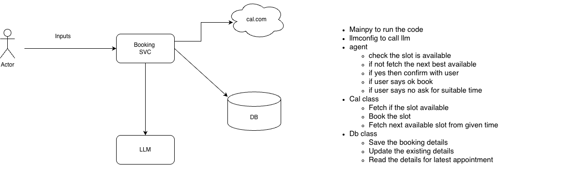

# Booking Agent

An intelligent booking system that uses Large Language Models (LLM) to facilitate natural language interactions for scheduling appointments through an external calendar service.

## Problem Statement

The Booking Agent system addresses the need for an intelligent, conversational interface to manage appointment bookings. Users need a way to:
- Request appointments using natural language
- Automatically check slot availability
- Get intelligent suggestions for alternative times when preferred slots are unavailable
- Seamlessly book appointments through an external calendar service
- Maintain a record of booking history

## Solution Overview

The Booking Agent is a service-oriented system that orchestrates interactions between:
- **Natural Language Processing** (via LLM) to understand user requests
- **External Calendar Service** (cal.com) for slot availability and booking
- **Database** for persisting booking information
- **Intelligent Agent Logic** that handles the booking workflow

## High-Level Architecture



The system consists of a central **Booking Service** that coordinates between:
- **cal.com**: External calendar service for slot management
- **LLM**: Large Language Model for natural language understanding
- **DB**: Database for storing booking records

## Components

### 1. Main Entry Point (`main.py`)
The primary script to run the Booking Agent application.

### 2. LLM Configuration (`llm_config/`)
Module responsible for:
- Configuring and calling the Large Language Model
- Handling API interactions with the LLM service

### 3. Agent Logic
The core booking agent workflow:
1. **Slot Availability Check**: Verifies if the requested time slot is available
2. **Alternative Slot Suggestion**: If unavailable, fetches the next best available slot
3. **User Confirmation**: Presents the slot to the user for confirmation
4. **Booking Execution**: 
   - If user confirms ("ok"), books the slot
   - If user declines ("no"), requests a suitable alternative time

### 4. Cal Class
Interface to the external calendar service (cal.com):
- **Fetch Slot Availability**: Retrieves available time slots
- **Book Slot**: Books a specific time slot
- **Get Next Available Slot**: Finds the next available slot from a given time

### 5. DB Class
Database operations for booking management:
- **Save Booking**: Stores new booking details
- **Update Booking**: Modifies existing booking information
- **Read Latest Appointment**: Retrieves details for the most recent appointment

## Setup

### Prerequisites
- Python 3.13+
- UV package manager

### Installation

1. Clone the repository:
```bash
git clone <repository-url>
cd BookingAgent
```

2. Install dependencies:
```bash
uv sync
```

3. Create a `.env` file in the project root:
```env
ANTHROPIC_API_KEY=your_anthropic_api_key_here
```

### Running the Application

```bash
uv run main.py
```

## Usage

The Booking Agent processes natural language input to:
1. Understand booking requests
2. Check calendar availability
3. Suggest alternatives when needed
4. Confirm and book appointments
5. Store booking records

## Project Structure

```
BookingAgent/
├── main.py                 # Main entry point
├── llm_config/            # LLM configuration module
│   ├── config.py          # LLM client configuration
│   └── model_constants.py # Model constants
├── tools/                 # Additional utilities
├── pyproject.toml         # Project dependencies
└── README.md              # This file
```

## Dependencies

- `anthropic`: Anthropic API client for LLM interactions
- `python-dotenv`: Environment variable management

