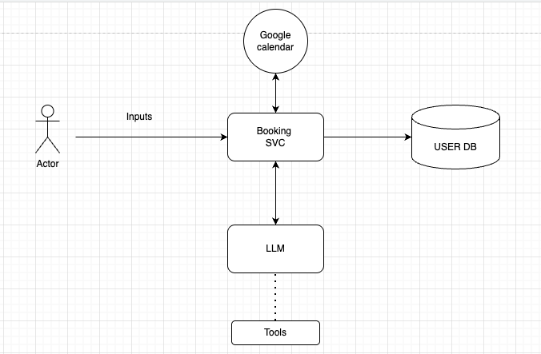

# BookingAgent

A booking assistant that connects to your Google Calendar and lets you chat to **check availability** and **book slots**.

## Main workflows

1. **Connect Google Calendar**
   - User completes Google OAuth and grants calendar access.

2. **Chat to book / check availability**
   - User chats with the LLM to find open times and book an event on their calendar.

## Architecture

## Technical stack

- **Frontend**: Vanilla HTML/CSS/JS (`frontend/`) served by the backend
- **Backend**: Python + FastAPI (`server/`)
- **LLM / Agent**: LangGraph + LangChain (`brain/`), using **Groq** (primary)
- **Calendar**: Google Calendar API + Google OAuth
- **Database**: Postgres

## Prerequisites
- Python **3.12.x**
- `uv` installed
- **Groq API key** (required)
- **Google OAuth Client ID/Secret** with redirect URI:
  - `http://localhost:8000/oauth/google/callback`

## Install
- activate venv
- uv sync

## Run locally
- uv run uvicorn server.api:app --reload